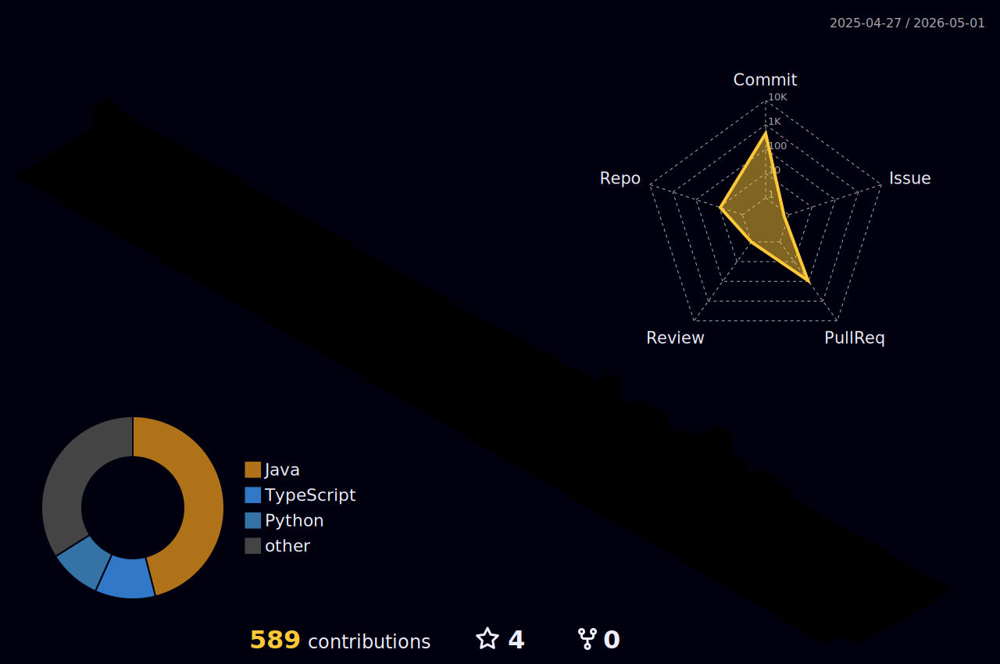

<h1 align="center">Hi there,I'm Tunahan Türker Ertürk! 👋</h1>

  
  
  

---

### 📚 About Me
- 🎓 Software Engineer focused on **Java Backend Development**
- ☕ Actively working with **Java & Spring Framework**
- 🧱 Interested in **Backend Architecture, REST APIs, Clean Code, and Scalable Systems**
- 🤖 Background and interest in **Machine Learning & Computer Vision**
- ✨ Passionate about **Photography & Visual Technologies**
- 🌍 Open-source friendly, learning by building

---

## 🛠️ Tech Stack

### Programming Languages

<!--  -->

---

### 🌱 Backend Frameworks & Libraries

---

### 🤖 AI & Computer Vision (Background)

---

### ⚙️ Tools & Platforms

---

<h3 align="left">📊 GitHub Statistics</h3>

<table width="100%" border="0" cellpadding="0" cellspacing="5">
  <tr>
    <td width="50%" valign="top">
      
    </td>
    <td width="50%" valign="top">

  </tr>
  <tr>
    <td width="50%" valign="top" style="line-height: 0;">
      
  <td width="60%" valign="top" style="line-height: 0;">
  

    
  

</td>
  </tr>
</table>

  

---

## 🧬 Contribution Visualizations

### 🐍 Contribution Snake

### 📊 3D Contribution Graph

<!--  -->

---

## 📊 GitHub Metrics

---

### 👉 Connect with Me

---

> _“Learning backend engineering by building real systems, one commit at a time.”_

